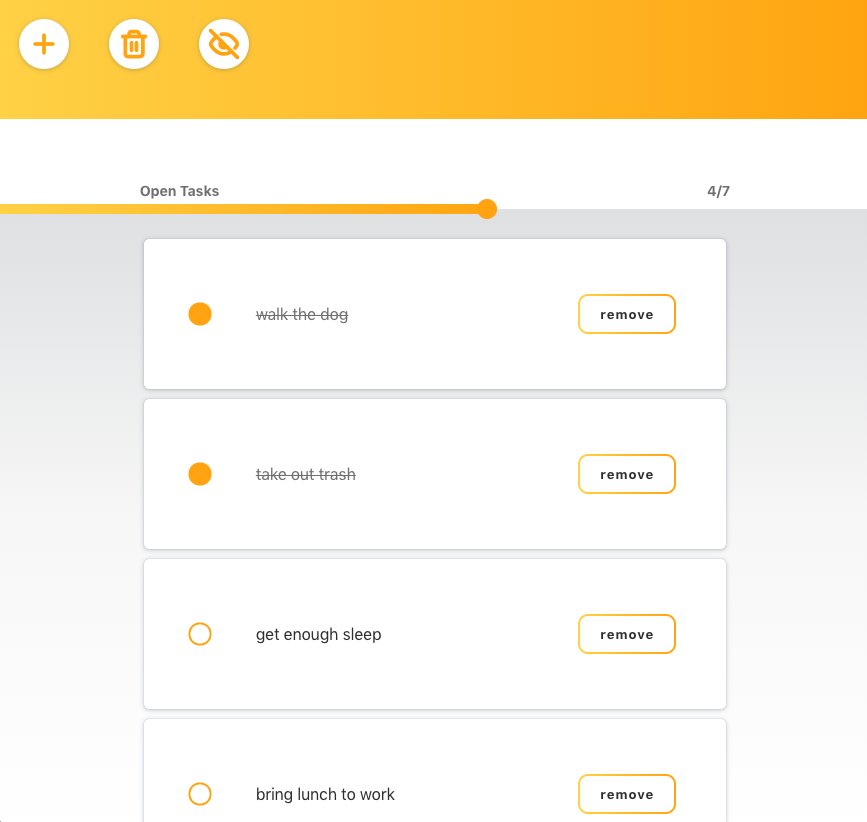
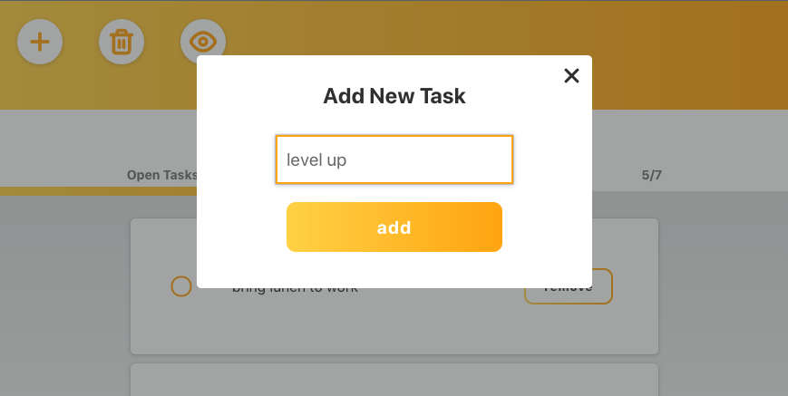

This project was bootstrapped with [Create React App](https://github.com/facebook/create-react-app).
## Todo List
This project was created as a quick challenge to show my skills in React.

Features:
- Add/Delete task
- Delete all tasks
- Mark/unmark task as completed
- Show/Hide completed tasks
- Progress bar of completed tasks
- Higher-order components (modal)
- Single database table on heroku

## Available Scripts

In the project directory, you can run:
### `npm install`
### `npm run start-node`
### `npm start`

Project will run on http://localhost:3000/

